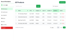
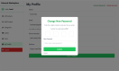

# Admin Dashboard

The backend is built using Express.js, with Mongoose as the database ODM, and JsonWebToken (JWT) for authentication. Additional features include email functionality for OTP registration, forget password, change email, and change password, powered by Nodemailer.

The frontend is developed using React.js, with Vite as the build tool. It includes state management with @reduxjs/toolkit, and libraries for notifications (react-hot-toast), icons (react-icons), loading skeletons (react-loading-skeleton), and dropdowns (react-select). Styling is handled using Tailwind CSS, ensuring a responsive and modern user interface.

#### Demo
[Click to see the demo](https://adminedu.onrender.com)

## Run Locally

Clone the project

```bash
  git clone https://github.com/faukiofficial/admindashboard.git
```

### Backend

Go to the project directory

```bash
  cd server
```

Install dependencies

```bash
  npm install
```

Start the server

```bash
  npm start
```

### Frontend

Go to the project directory

```bash
  cd client
```

Install dependencies

```bash
  npm install
```

Start the server

```bash
  npm run dev
```


## Environment Variables

### Backend (.env)

`NODE_ENV`

`CLIENT_URL`

`PORT`

`MONGO_URI`

`ACTIVATION_TOKEN_SECRET`

`JWT_SECRET`

`REFRESH_TOKEN_SECRET`

`SMTP_HOST`

`SMTP_PORT`

`SMTP_SERVICE`

`SMTP_MAIL`

`SMTP_PASSWORD`


### Frontend (.env.local)

`VITE_SERVER_URL`


### Views

#### Dashboard


#### Change Password

